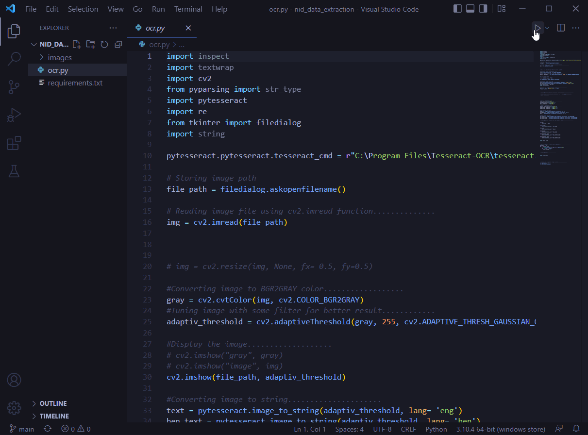

# NID-Image-to-data-extraction

## How to run code in your windows machine

Step-1: Install `python3` 

Step-2: Install `Tesseract` on Windows:
        go on this page https://github.com/UB-Mannheim/tesseract/wiki, download and install tesseract 64 bit at default location.
        
Step-3: Run this command to get all the dependencis:
```
pip3 install -r requirements.txt
```
Step-4: Now you can run the project.:+1:



